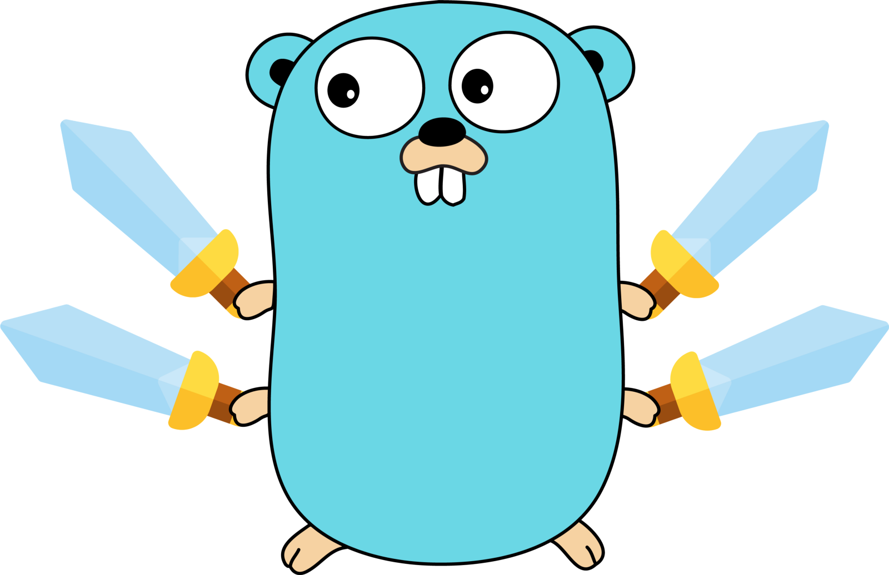

# go-xcipher

<div align="center">



[](https://pkg.go.dev/github.com/landaiqing/go-xcipher)
[](https://goreportcard.com/report/github.com/landaiqing/go-xcipher)
[](LICENSE)
[](https://github.com/landaiqing/go-xcipher/releases/latest)

</div>

[中文文档](README_CN.md) | English

## Project Overview

go-xcipher is a high-performance, easy-to-use Go encryption library based on the ChaCha20-Poly1305 algorithm that provides secure data encryption and decryption. The library is specially optimized for handling large files and data streams, supporting parallel encryption/decryption, memory optimization, and cancellable operations.

## ✨ Features

- 🔒 High-strength encryption using the proven ChaCha20-Poly1305 algorithm
- 🚀 Performance optimized for large data and streaming data
- 🧵 Automatic parallel processing for large datasets to increase throughput
- 📊 Detailed statistics for performance monitoring and optimization
- 🧠 Intelligent memory management to reduce memory allocation and GC pressure
- ⏹️ Support for cancellable operations suitable for long-running tasks
- 🛡️ Comprehensive error handling and security checks

## 🔧 Installation

```bash
go get -u github.com/landaiqing/go-xcipher
```

Ensure you are using Go 1.18 or higher.

## 📝 Usage Examples

### Simple Encryption/Decryption

```go
package main

import (
    "fmt"
    "github.com/landaiqing/go-xcipher"
    "golang.org/x/crypto/chacha20poly1305"
)

func main() {
    // Create a 32-byte key (this is just an example; in real applications, keys should be securely generated and stored)
    key := make([]byte, chacha20poly1305.KeySize)
    
    // Initialize the cipher
    cipher := xcipher.NewXCipher(key)
    
    // Data to encrypt
    plaintext := []byte("sensitive data")
    
    // Optional additional authenticated data
    additionalData := []byte("header")
    
    // Encrypt
    ciphertext, err := cipher.Encrypt(plaintext, additionalData)
    if err != nil {
        panic(err)
    }
    
    // Decrypt
    decrypted, err := cipher.Decrypt(ciphertext, additionalData)
    if err != nil {
        panic(err)
    }
    
    fmt.Println("Decrypted:", string(decrypted))
}
```

### Stream Encryption

```go
package main

import (
    "fmt"
    "os"
    "github.com/landaiqing/go-xcipher"
    "golang.org/x/crypto/chacha20poly1305"
)

func main() {
    // Create a key
    key := make([]byte, chacha20poly1305.KeySize)
    
    // Initialize the cipher
    cipher := xcipher.NewXCipher(key)
    
    // Open the file to encrypt
    inputFile, _ := os.Open("largefile.dat")
    defer inputFile.Close()
    
    // Create the output file
    outputFile, _ := os.Create("largefile.encrypted")
    defer outputFile.Close()
    
    // Set stream options
    options := xcipher.DefaultStreamOptions()
    options.UseParallel = true  // Enable parallel processing
    options.BufferSize = 64 * 1024  // Set buffer size
    options.CollectStats = true  // Collect performance statistics
    
    // Encrypt the stream
    stats, err := cipher.EncryptStreamWithOptions(inputFile, outputFile, options)
    if err != nil {
        panic(err)
    }
    
    // Show performance statistics
    fmt.Printf("Processing time: %v\n", stats.Duration())
    fmt.Printf("Throughput: %.2f MB/s\n", stats.Throughput)
}
```

## 📋 API Documentation

### Core Types

```go
type XCipher struct {
    // Fields unexported
}

// Statistics for stream processing
type StreamStats struct {
    StartTime time.Time
    EndTime time.Time
    BytesProcessed int64
    BlocksProcessed int
    AvgBlockSize float64
    Throughput float64
    ParallelProcessing bool
    WorkerCount int
    BufferSize int
}

// Stream processing options
type StreamOptions struct {
    BufferSize int
    UseParallel bool
    MaxWorkers int
    AdditionalData []byte
    CollectStats bool
    CancelChan <-chan struct{}
}
```

### Main Functions and Methods

- `NewXCipher(key []byte) *XCipher` - Create a new cipher instance
- `(x *XCipher) Encrypt(data, additionalData []byte) ([]byte, error)` - Encrypt data
- `(x *XCipher) Decrypt(cipherData, additionalData []byte) ([]byte, error)` - Decrypt data
- `(x *XCipher) EncryptStream(reader io.Reader, writer io.Writer, additionalData []byte) error` - Encrypt a stream with default options
- `(x *XCipher) DecryptStream(reader io.Reader, writer io.Writer, additionalData []byte) error` - Decrypt a stream with default options
- `(x *XCipher) EncryptStreamWithOptions(reader io.Reader, writer io.Writer, options StreamOptions) (*StreamStats, error)` - Encrypt a stream with custom options
- `(x *XCipher) DecryptStreamWithOptions(reader io.Reader, writer io.Writer, options StreamOptions) (*StreamStats, error)` - Decrypt a stream with custom options
- `DefaultStreamOptions() StreamOptions` - Get default stream processing options

## 🚀 Performance

go-xcipher is optimized to handle data of various scales, from small messages to large files. Here are some benchmark results:

- Small data packet encryption: ~1.5 GB/s
- Large file parallel encryption: ~4.0 GB/s (depends on CPU cores and hardware)
- Memory efficiency: Memory usage remains low even when processing large files

## 🤝 Contributing

Issues and Pull Requests are welcome to help improve go-xcipher. You can contribute by:

1. Reporting bugs
2. Submitting feature requests
3. Submitting code improvements
4. Improving documentation

## 📜 License

go-xcipher is licensed under the Apache License 2.0 - see the [LICENSE](LICENSE) file for details.

