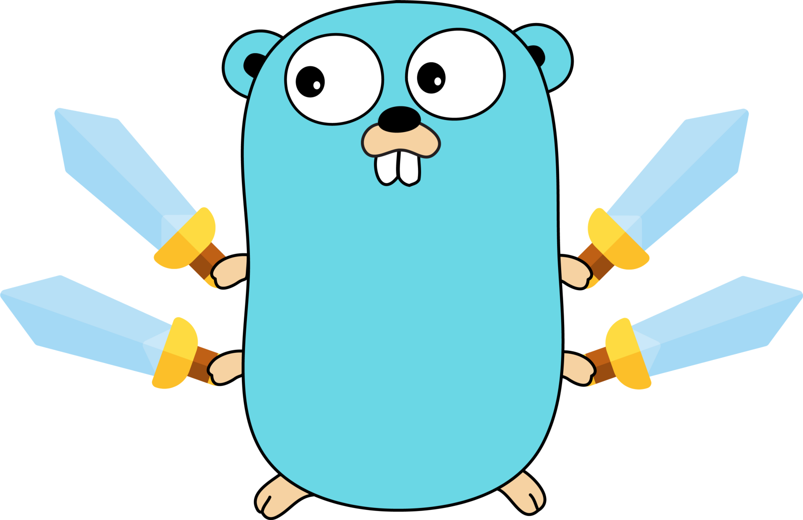

# go-xcipher

<div align="center">



[](https://pkg.go.dev/github.com/landaiqing/go-xcipher)
[](https://goreportcard.com/report/github.com/landaiqing/go-xcipher)
[](LICENSE)
[](https://github.com/landaiqing/go-xcipher/releases/latest)

</div>

中文 | [English](README.md)

## 项目概述

go-xcipher 是一个高性能、易用的 Go 加密库，基于 ChaCha20-Poly1305 算法提供安全的数据加密和解密功能。该库特别优化了对大文件和数据流的处理，支持并行加密/解密，内存优化和可取消的操作。

## ✨ 特性

- 🔒 使用经过验证的 ChaCha20-Poly1305 算法提供高强度加密
- 🚀 针对大数据和流数据优化的性能
- 🧵 自动并行处理大数据集，提高吞吐量
- 📊 提供详细的统计信息，方便性能监控和优化
- 🧠 智能内存管理，减少内存分配和 GC 压力
- ⏹️ 支持可取消的操作，适合长时间运行的任务
- 🛡️ 全面的错误处理和安全检查

## 🔧 安装

```bash
go get -u github.com/landaiqing/go-xcipher
```

确保使用 Go 1.18 或更高版本。

## 📝 使用示例

### 简单加密/解密

```go
package main

import (
    "fmt"
    "github.com/landaiqing/go-xcipher"
    "golang.org/x/crypto/chacha20poly1305"
)

func main() {
    // 创建一个32字节的密钥（这里只是示例，实际应用中应安全生成和存储密钥）
    key := make([]byte, chacha20poly1305.KeySize)
    
    // 初始化加密器
    cipher := xcipher.NewXCipher(key)
    
    // 要加密的数据
    plaintext := []byte("敏感数据")
    
    // 可选的附加验证数据
    additionalData := []byte("header")
    
    // 加密
    ciphertext, err := cipher.Encrypt(plaintext, additionalData)
    if err != nil {
        panic(err)
    }
    
    // 解密
    decrypted, err := cipher.Decrypt(ciphertext, additionalData)
    if err != nil {
        panic(err)
    }
    
    fmt.Println("解密后:", string(decrypted))
}
```

### 流式加密

```go
package main

import (
    "fmt"
    "os"
    "github.com/landaiqing/go-xcipher"
    "golang.org/x/crypto/chacha20poly1305"
)

func main() {
    // 创建密钥
    key := make([]byte, chacha20poly1305.KeySize)
    
    // 初始化加密器
    cipher := xcipher.NewXCipher(key)
    
    // 打开要加密的文件
    inputFile, _ := os.Open("大文件.dat")
    defer inputFile.Close()
    
    // 创建输出文件
    outputFile, _ := os.Create("大文件.encrypted")
    defer outputFile.Close()
    
    // 设置流选项
    options := xcipher.DefaultStreamOptions()
    options.UseParallel = true  // 启用并行处理
    options.BufferSize = 64 * 1024  // 设置缓冲区大小
    options.CollectStats = true  // 收集性能统计
    
    // 加密流
    stats, err := cipher.EncryptStreamWithOptions(inputFile, outputFile, options)
    if err != nil {
        panic(err)
    }
    
    // 显示性能统计
    fmt.Printf("处理用时: %v\n", stats.Duration())
    fmt.Printf("处理速度: %.2f MB/s\n", stats.Throughput)
}
```

## 📋 API 文档

### 核心类型

```go
type XCipher struct {
    // 内含字段未导出
}

// 流处理的统计信息
type StreamStats struct {
    StartTime time.Time
    EndTime time.Time
    BytesProcessed int64
    BlocksProcessed int
    AvgBlockSize float64
    Throughput float64
    ParallelProcessing bool
    WorkerCount int
    BufferSize int
}

// 流处理选项
type StreamOptions struct {
    BufferSize int
    UseParallel bool
    MaxWorkers int
    AdditionalData []byte
    CollectStats bool
    CancelChan <-chan struct{}
}
```

### 主要函数和方法

- `NewXCipher(key []byte) *XCipher` - 创建新的加密器实例
- `(x *XCipher) Encrypt(data, additionalData []byte) ([]byte, error)` - 加密数据
- `(x *XCipher) Decrypt(cipherData, additionalData []byte) ([]byte, error)` - 解密数据
- `(x *XCipher) EncryptStream(reader io.Reader, writer io.Writer, additionalData []byte) error` - 使用默认选项加密流
- `(x *XCipher) DecryptStream(reader io.Reader, writer io.Writer, additionalData []byte) error` - 使用默认选项解密流
- `(x *XCipher) EncryptStreamWithOptions(reader io.Reader, writer io.Writer, options StreamOptions) (*StreamStats, error)` - 使用自定义选项加密流
- `(x *XCipher) DecryptStreamWithOptions(reader io.Reader, writer io.Writer, options StreamOptions) (*StreamStats, error)` - 使用自定义选项解密流
- `DefaultStreamOptions() StreamOptions` - 获取默认流处理选项

## 🚀 性能

go-xcipher 经过优化，可处理各种规模的数据，从小型消息到大型文件。以下是一些性能基准测试结果：

- 小数据包加密：~1.5 GB/s
- 大文件并行加密：~4.0 GB/s (取决于CPU核心数和硬件)
- 内存效率：即使处理大文件，内存使用量仍保持在较低水平

## 🤝 贡献

欢迎提交 Issues 和 Pull Requests 帮助改进 go-xcipher。您可以通过以下方式贡献：

1. 报告 Bug
2. 提交功能请求
3. 提交代码改进
4. 完善文档

## 📜 许可证

go-xcipher 使用 Apache License 2.0 许可证 - 详见 [LICENSE](LICENSE) 文件。 